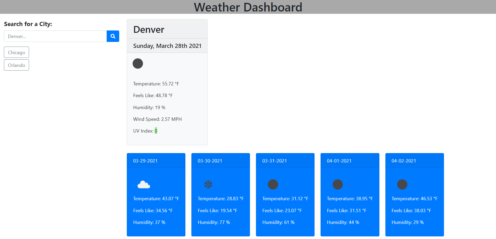
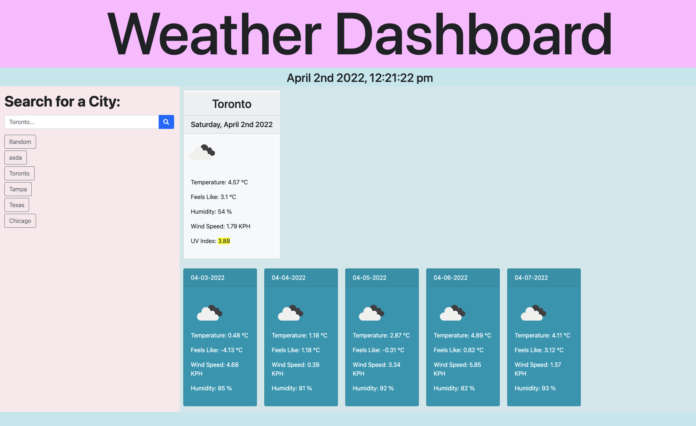

# Server-Side APIs Challenge: Weather Dashboard
## By Sultan Siddiqi
## Email: sultan.siddiqi@gmail.com
## GitLab Profile: sultansiddiqi

## Link to Challenge 
https://sultansiddiqi.github.io/Challenge-006-Server-Side-APIs-Challenge-Weather-Dashboard/

## Project Description

The purpose of this website is to allow a user to search a city and get the current weather, as well as a five day forecast with relevant information. It will also store the past search results allowing the user to select them and see that cities weather data again.  

To use the dashboard type the name of a city in the search box and select the spyglass. As you search the city will be saved to a list allowing you to select them again for viewing.   

## Code was to resemble the following Image + My version

## Contribution
Created by Sultan Siddiqi

